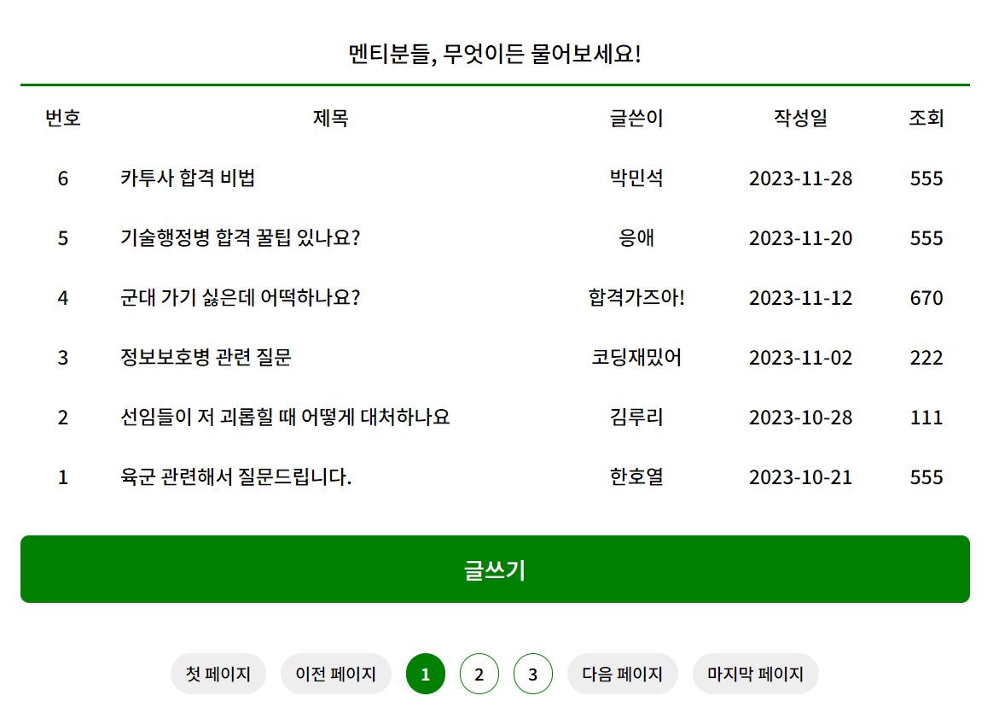
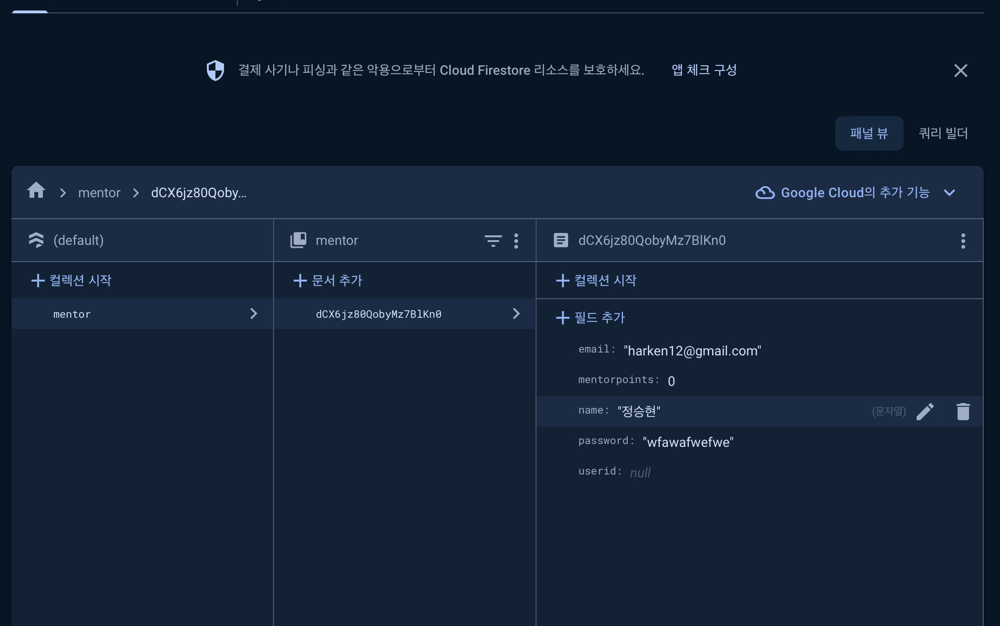

# daegu-hackaton

팀명 : knu_idle

제출 타입 및 주제 : E타입 - 기술행정병이나 운전병 등(군대) 각종 분과에 합격한 후기 애플리케이션

프로젝트 한 줄 설명 : 입영 예정자의 입영 관련 지식을 해결하기 위해 로그인 기술과 댓글 기능을 이용하였음.

프로젝트에 활용된 기술 : 프론트, 서버

프론트 : html, css, javascript를 이용해서 게시판 기능과 글쓰는 기능을 구현하였다.

서버 : firebase, node.js, ejs를 이용해 회원가입을 하면 이메일과 비밀번호, 이름을 받아온다.

https://github.com/snailkim0124/daegu-hackaton/tree/master (서버 리포지토리)

시연 영상 : 